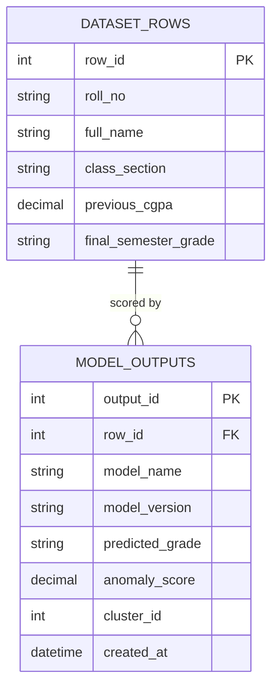

# 🎓 Edu Growth
### AI-Driven Batch Performance & Student Analytics System

> **Team Ctrl Freaks** · Domain: EdTech / Machine Learning · Doc Version 1.0

**Edu Growth** is an AI-driven student performance and academic analytics system built to analyze student-level academic data and identify meaningful performance patterns.

The project uses a **99-column student performance dataset** containing attendance, subject-wise assessments, assignments, quizzes, practical/lab performance, extracurricular participation, previous CGPA, and final semester grade.

The current data analysis pipeline has completed **Exploratory Data Analysis (EDA), data cleaning, preprocessing, and Principal Component Analysis (PCA)**.

During data cleaning, the original dataset of **49,000 rows** was reduced to **46,500 rows** after removing duplicate records. The cleaned dataset was then used for further analysis and dimensionality reduction.

PCA was performed on **97 numerical features** after excluding identifiers, categorical fields, and the target variable. Using StandardScaler and PCA, the feature space was reduced from **97 features to 76 principal components while retaining approximately 90.01% of the total variance**.

The project is being developed progressively, with further machine learning and application components planned for later stages.
.

---

## 📑 Table of Contents
1. [Problem Statement](#-problem-statement)
2. [Solution](#-solution)
3. [Dataset: 99 Columns](#-dataset-99-columns)
4. [Analysis Workflow](#-analysis-workflow)
5. [Machine Learning Models](#-machine-learning-models)
6. [Database Design](#-database-design-postgresql)
7. [API Overview](#-api-overview)
8. [Tech Stack](#-tech-stack)
9. [Setup](#-setup)
10. [Project Structure](#-project-structure)
11. [Team](#-team)
12. [Roadmap](#-roadmap)

---

## ⚠️ Problem Statement

| Problem | What happens today |
|---|---|
| **Coarse evaluation** | Overall grades can hide differences between subjects and the five unit scores recorded for each subject. |
| **Disconnected signals** | Attendance, assessment marks, assignment delays, lab performance, and participation are often reviewed separately. |
| **Late intervention** | A final grade alone does not show which currently available signals may warrant an earlier human review. |
| **Unclear patterns** | Staff need a consistent way to compare students and subjects without treating a model score as a diagnosis. |

## 💡 Solution

- **One validated student profile** – ingest the spreadsheet and check required columns, types, duplicates, missing values, and plausible ranges.
- **Subject and unit insights** – compare ST1, ST2, PUT, unit marks, assignments, quizzes, and attendance across the six subjects.
- **Practical performance view** – compare execution and viva scores with submission delays across the four labs.
- **Final-grade estimation** – train a supervised model using `final_semester_grade` as the target and only information available before that outcome.
- **Exploratory student groups and outliers** – use PCA, clustering, and anomaly scores to support review, not to assign definitive risk labels.
- **Human-reviewed support** – show contributing signals and keep medical leave as sensitive context, never as a penalty or an automated decision.

## 🗺 Analysis Workflow

```mermaid
flowchart TD
 ## 🗺 Analysis Workflow

```mermaid
flowchart TD
    A["Raw Dataset<br/>49,000 rows × 99 columns"] --> B["EDA & Data Cleaning"]
    B --> C["Cleaned Dataset<br/>46,500 rows"]
    C --> D["Exploratory Analysis<br/>Univariate • Bivariate • Multivariate"]
    C --> E["PCA Preparation<br/>97 numerical features"]
    E --> F["StandardScaler"]
    F --> G["PCA<br/>76 Components"]
    G --> H["~90.01% Variance Retained"]
    H --> I["PCA Transformed Dataset<br/>46,500 × 76"]
    I --> J["Further ML Analysis<br/>Planned"]
```

### 📋 Dataset: 99 Columns

**Source:** Edu Growth student dataset (Google Sheets). The dataset contains academic and student-level information used for performance analysis.

The original dataset contains **49,000 rows and 99 columns**. The schema is organized into the following groups:

| Group                           |  Count | Columns                                                                                                                                                                                                                                    |
| ------------------------------- | -----: | ------------------------------------------------------------------------------------------------------------------------------------------------------------------------------------------------------------------------------------------ |
| Student information and add-ons |     11 | `roll_no`, `full_name`, `class_section`, `overall_attendance_pct`, `theory_attendance_pct`, `practical_attendance_pct`, `previous_cgpa`, `medical_leave_days`, `society_participation_pc`, `sports_activity_level`, `final_semester_grade` |
| Subject attendance              |      6 | `coa_attendance_pct`, `maths4_attendance_pct`, `dstl_attendance_pct`, `ds_attendance_pct`, `python_attendance_pct`, `cyber_attendance_pct`                                                                                                 |
| Lab attendance                  |      4 | `lab_ds_attendance_pct`, `lab_python_attendance_pct`, `lab_coa_attendance_pct`, `lab_cyber_attendance_pct`                                                                                                                                 |
| COA assessments                 |     11 | `coa_st1_marks`, `coa_st2_marks`, `coa_put_marks`, `coa_unit_1_marks`–`coa_unit_5_marks`, `coa_assignment_score`, `coa_assignment_delay_hours`, `coa_quiz_score`                                                                           |
| Maths4 assessments              |     11 | `maths4_st1_marks`, `maths4_st2_marks`, `maths4_put_marks`, `maths4_unit_1_marks`–`maths4_unit_5_marks`, `maths4_assignment_score`, `maths4_assignment_delay_hours`, `maths4_quiz_score`                                                   |
| DSTL assessments                |     11 | `dstl_st1_marks`, `dstl_st2_marks`, `dstl_put_marks`, `dstl_unit_1_marks`–`dstl_unit_5_marks`, `dstl_assignment_score`, `dstl_assignment_delay_hours`, `dstl_quiz_score`                                                                   |
| DS assessments                  |     11 | `ds_st1_marks`, `ds_st2_marks`, `ds_put_marks`, `ds_unit_1_marks`–`ds_unit_5_marks`, `ds_assignment_score`, `ds_assignment_delay_hours`, `ds_quiz_score`                                                                                   |
| Python assessments              |     11 | `python_st1_marks`, `python_st2_marks`, `python_put_marks`, `python_unit_1_marks`–`python_unit_5_marks`, `python_assignment_score`, `python_assignment_delay_hours`, `python_quiz_score`                                                   |
| Cybersecurity assessments       |     11 | `cyber_st1_marks`, `cyber_st2_marks`, `cyber_put_marks`, `cyber_unit_1_marks`–`cyber_unit_5_marks`, `cyber_assignment_score`, `cyber_assignment_delay_hours`, `cyber_quiz_score`                                                           |
| Lab performance                 |     12 | For `ds`, `python`, `coa`, and `cyber`: execution score, viva score, and submission delay                                                                                                                                                  |
| **Total**                       | **99** | Includes `final_semester_grade` as the target variable                                                                                                                                                                                     |

### 🧹 Data Cleaning and EDA Status

The initial dataset contained **49,000 rows**. During preprocessing:

* **2,500 duplicate records** were removed.
* The cleaned dataset contains **46,500 rows and 99 original columns**.
* Text and categorical values were cleaned and standardized.
* Invalid values were identified and handled.
* Missing values were treated using appropriate methods.
* Outliers were identified using the **IQR method** without directly deleting the detected observations.
* `overall_attendance_pct` was converted from percentage-formatted values into numerical values.
* Categorical features such as `class_section` and `sports_activity_level` were standardized.
* Univariate, bivariate, and multivariate analysis was performed.
* Correlation and outlier analysis were also performed.

The cleaned dataset was exported as:

`edu_growth_cleaned.csv`

### 📊 Current Analysis Capabilities

* **Student and cohort analysis:** Analyze attendance, previous CGPA, marks, laboratory performance, and participation patterns.
* **Subject and assessment analysis:** Compare ST1, ST2, PUT, unit tests, assignments, quizzes, and other assessment patterns across subjects.
* **Lab performance analysis:** Analyze execution, viva, attendance, and submission-delay patterns.
* **PCA-based dimensionality reduction:** PCA was performed on **97 numerical features** after excluding identifiers, categorical fields, and the target variable. The feature space was reduced to **76 principal components while retaining approximately 90.01% variance**.
* **Grade prediction:** Planned for a later stage using `final_semester_grade` as the target variable.
* **Student clustering:** Planned for a later stage to identify meaningful student groups.
* **Anomaly detection:** Planned for a later stage to identify unusual feature combinations.

> **Note:** The current dataset is cross-sectional. Therefore, conclusions about learning velocity, intervention recovery, or changes over time require additional dated student records.

## 🤖 Machine Learning Models

| Objective | Algorithm | Input Features | Output / Evaluation |
|---|---|---|---|
| **Final semester grade estimate** | Baseline classifier or regressor, selected after inspecting target values | Eligible attendance, prior CGPA, assessment, assignment, quiz, lab, and participation fields | Predicted `final_semester_grade`; report validation metrics appropriate to its actual type |
| **Anomaly review** | Isolation Forest | Scaled numeric features selected for the use case | Anomaly score for human review; not a ground-truth risk class |
| **Exploratory grouping** | PCA followed by K-Means | Scaled, leakage-checked academic features | Candidate clusters to interpret and validate; no fixed labels or cluster count assumed |

### Preprocessing & Feature Engineering
1. Validate the 99-column schema, duplicate `roll_no` values, data types, score ranges, and missingness before imputation.
2. Exclude `roll_no` and `full_name` from model features. Treat `class_section` as categorical and consider it when splitting evaluation data.
3. Exclude `final_semester_grade` from predictors; use it only as the supervised target. Confirm every predictor is available before the grade is known to prevent leakage.
4. Encode `sports_activity_level`, impute only after inspecting missingness, and scale numeric features for PCA and distance-based models.
5. Keep `medical_leave_days` out of automated risk or anomaly scoring by default. If used for analysis, restrict access and interpret it as sensitive context, not a performance penalty.
6. Use held-out validation and report measured results; no performance target is claimed until the dataset has been evaluated.

---

## 🗄 Database Design (PostgreSQL)

The supplied CSV/Sheet is the source of truth. A database is optional for initial EDA; if PostgreSQL is added, retain the source fields in an import table and store generated outputs separately. The dataset contains no teacher records.



The diagram shows representative fields only; the import table must retain all 99 source columns. Restrict access to names, roll numbers, and medical leave data; do not expose them in model exports or general analytics.

---

## 🔌 API Overview

> Proposed endpoints only; the current FastAPI files are scaffolds and these routes are not implemented yet.

| Method | Endpoint | Description |
|---|---|---|
| `POST` | `/api/v1/datasets/import` | Validate and import the 99-column CSV |
| `GET` | `/api/v1/students/{roll_no}` | Student profile with subject, unit, attendance, and lab summaries |
| `GET` | `/api/v1/students/{roll_no}/grade-prediction` | Estimated `final_semester_grade` with model version |
| `GET` | `/api/v1/students/{roll_no}/anomaly` | Exploratory anomaly score, not a risk label |
| `GET` | `/api/v1/analytics/subjects/{subject_code}` | Aggregate subject and unit analysis |
| `GET` | `/api/v1/analytics/pca` | Explained variance and component loadings |
| `GET` | `/api/v1/analytics/cohorts` | Validated exploratory cluster summaries |

---

## 🧰 Tech Stack

| Layer | Technology |
|---|---|
| **Data analysis** | Jupyter notebooks, pandas, NumPy |
| **ML** | scikit-learn (preprocessing, PCA, regression/classification, K-Means, Isolation Forest) |
| **Backend (planned)** | Python FastAPI and Uvicorn |
| **Database (optional)** | PostgreSQL for imported rows and model outputs |
| **Desktop UI (planned)** | JavaFX |

---

## 🚀 Setup

The repository currently contains the project scaffold; the pipeline, API, and UI are not runnable implementations yet. To prepare the data for EDA:

1. Export the linked Google Sheet as CSV and place it in `data/raw/` (for example, `messy_edu_growth_99_columns.csv`).
2. Create and activate a Python 3.10+ virtual environment.
3. Install the dependencies selected for the implementation. `requirements.txt` is currently empty, so dependency installation instructions will be added with the working pipeline.
4. Start with `notebooks/01_eda_data_cleaning.ipynb` and verify column names, target encoding, value ranges, duplicates, missingness, and whether one row represents one student.
5. Keep the exported dataset and any `.env` secrets local; do not commit personal student data.

---

## 📁 Project Structure

```text
data/
├── raw/
├── processed/
└── pca_transformed/
notebooks/
├── 01_eda_data_cleaning.ipynb
├── 02_pca_dimensionality_reduction.ipynb
├── 03_cgpa_prediction_model.ipynb
├── 04_mentor_clustering_model.ipynb
└── 05_risk_isolation_forest.ipynb
ml_pipeline/
├── __init__.py
├── config.py
├── preprocessor.py
├── pca_transformer.py
├── trainer.py
└── utils.py
artifacts/
app/
├── __init__.py
├── main.py
├── api/
│   ├── __init__.py
│   └── v1/
│       ├── __init__.py
│       ├── router.py
│       └── endpoints/
│           ├── __init__.py
│           ├── pca_analytics.py
│           ├── mentor.py
│           ├── cgpa.py
│           ├── risk.py
│           └── velocity.py
├── core/
│   ├── config.py
│   ├── security.py
│   └── database.py
├── services/
│   ├── __init__.py
│   ├── pca_service.py
│   ├── prediction_service.py
│   └── mentor_service.py
└── schemas/
    ├── __init__.py
    ├── student_schema.py
    ├── pca_schema.py
    └── response_schema.py
frontend_javafx/
tests/
├── test_pca_pipeline.py
└── test_endpoints.py
requirements.txt
.env.example
README.md
```

The data and artifact directories start empty. Keep local datasets, trained model files, and `.env` secrets out of version control; `.env.example` is the safe configuration template. The notebook filenames `03_cgpa_prediction_model.ipynb` and `05_risk_isolation_forest.ipynb` are inherited from the initial scaffold: the target is `final_semester_grade`, and anomaly scores are not risk labels.

---

## 👥 Team

**Team Ctrl Freaks**

| Member | Domain | Mentor(s) |
|---|---|---|
| Suhani Agarwal | Machine Learning | Harsh Raj, Anjali Sirohi |
| Syed Rafiuddin Altamash | Machine Learning | Harsh Raj, Anjali Sirohi |
| Akash Raghuvanshi | Machine Learning | Harsh Raj, Anjali Sirohi |
| Pranav Prajapati | Machine Learning | Harsh Raj, Anjali Sirohi |
| Raunak Agrahari | Frontend | Akshat Sharma |
| Vivek Soni | Backend | Shreya Singh |
| Prashant Singh | Designing | — |

**Planned ownership:** Suhani & Pranav – data validation and preprocessing; ML team – final-grade modeling, PCA, clustering, and anomaly review; Raunak – JavaFX client; Vivek – FastAPI and optional PostgreSQL; Prashant – UI/UX design.

---

## 🛣 Roadmap

- [x] 99-column spreadsheet schema documented
- [ ] Export the source sheet and profile its rows, types, categories, missing values, and score scales
- [ ] Implement schema validation, cleaning, and privacy-aware preprocessing
- [ ] Fit and evaluate PCA; choose component count from measured explained variance
- [ ] Train and validate a model for `final_semester_grade` after confirming target format and avoiding leakage
- [ ] Evaluate exploratory K-Means clusters and Isolation Forest anomaly scores with human review
- [ ] Implement CSV import and dataset-backed FastAPI analytics
- [ ] Build the JavaFX analytics client
- [ ] Collect dated snapshots and teacher-linked data before adding velocity or teacher-efficacy features

---

## 📄 License
Developed by Team Ctrl Freaks for academic purposes. Add a license (for example, MIT) before public release.
