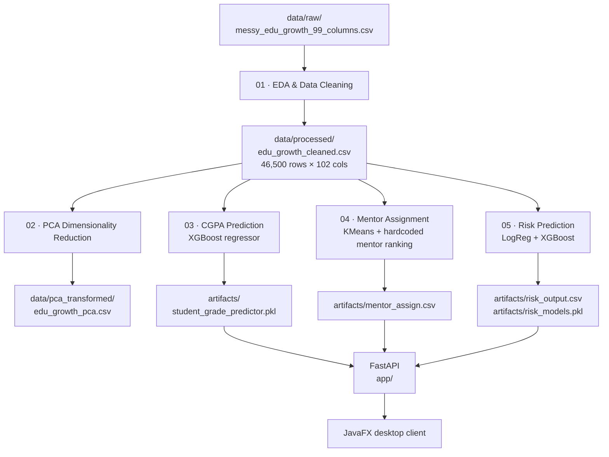
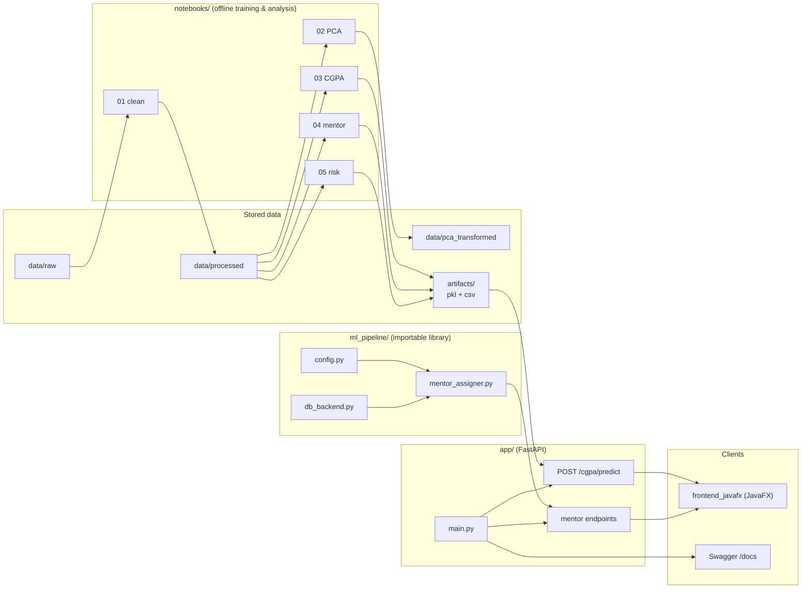
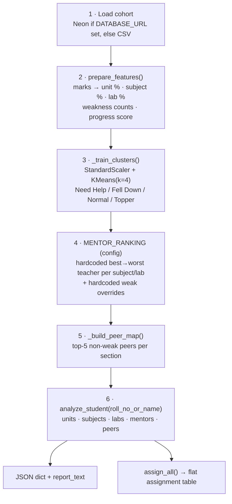
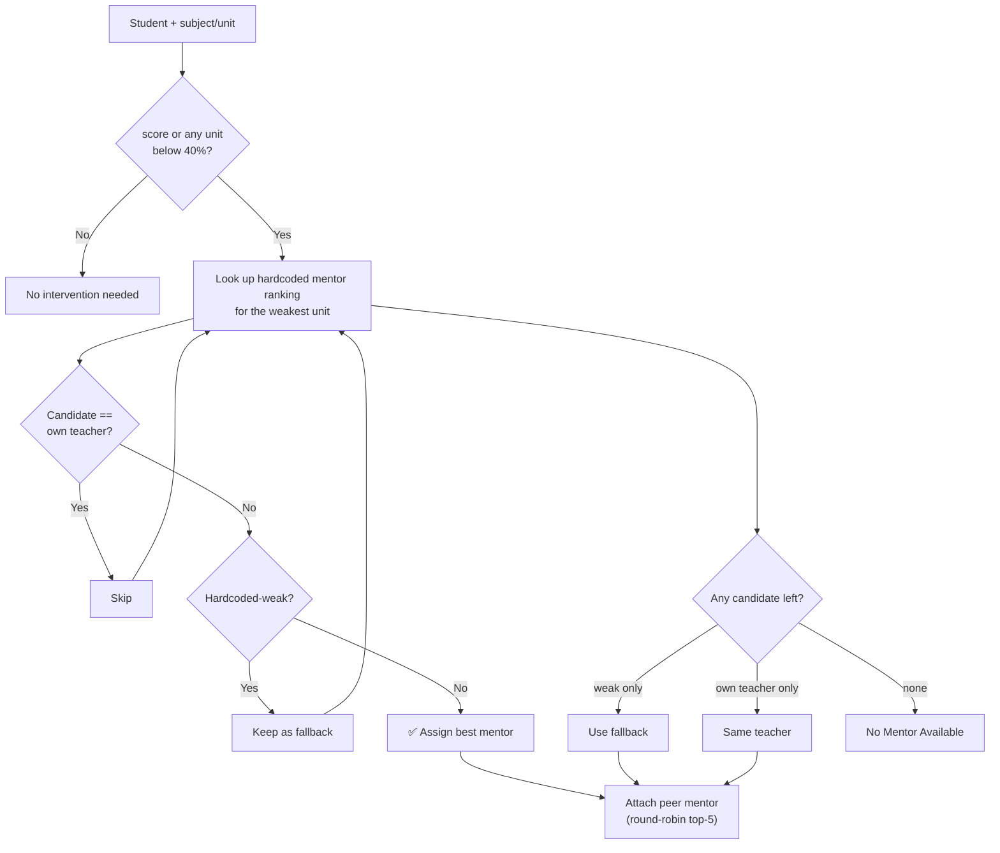
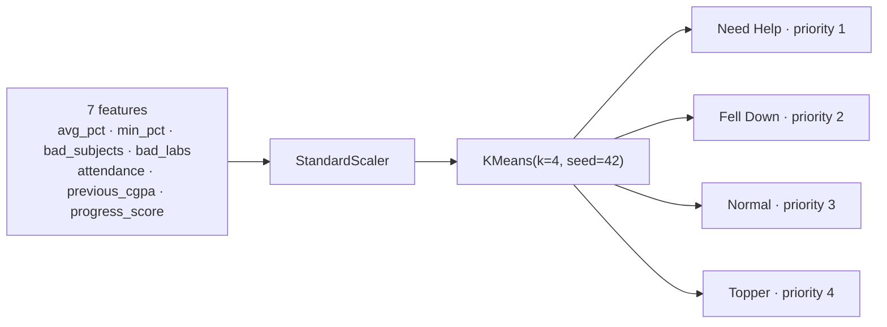
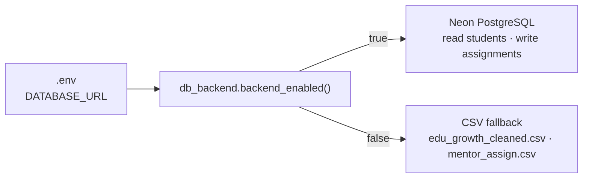

# EduGrowth — Student Performance Analytics Platform

An end-to-end data-science platform that turns raw, messy student records into
**actionable academic insights**: cleaned data, dimensionality reduction, CGPA
prediction, risk detection, and **automatic mentor assignment** — exposed through
a FastAPI service and an ML library.

- **Data →** clean the raw cohort → engineered feature tables.
- **Models →** PCA, CGPA regression, per-subject risk classifiers, KMeans mentor clustering.
- **Serve →** FastAPI endpoints (`/api/v1/...`) for predictions and mentor plans.
- **No fragile model files for mentors:** the mentor engine re-fits in ~5 s.

---

## 1. What the project contains

| Area | What it does | Where |
|---|---|---|
| **Data cleaning** | de-duplicate, fix wrong values, handle outliers, fill missing, repair grades | `notebooks/01_eda_data_cleaning.ipynb` |
| **Dimensionality reduction** | standardise features, inspect explained variance, PCA transform | `notebooks/02_pca_dimensionality_reduction.ipynb` |
| **CGPA prediction** | XGBoost regressor → predicted final grade + confidence | `notebooks/03_cgpa_prediction_model.ipynb`, `artifacts/student_grade_predictor.pkl` |
| **Mentor assignment** | unit/subject/lab analysis, KMeans risk clustering, hardcoded mentor ranking, peer matching | `notebooks/04_mentor_clustering_model.ipynb`, `ml_pipeline/` |
| **Risk prediction** | per-subject / per-lab / attendance risk classifiers (LogReg + XGBoost) | `notebooks/05_risk_prediction.ipynb` |
| **Serving layer** | FastAPI app with CGPA prediction + mentor endpoints | `app/` |
| **Database layer** | Neon / PostgreSQL adapter (CSV fallback) | `ml_pipeline/db_backend.py` |
| **Desktop UI** | JavaFX client (planned / scaffold) | `frontend_javafx/` |

---

## 2. End-to-end data & model pipeline



---

## 3. System architecture



---

## 4. Notebooks

| # | Notebook | Input | Output |
|---|---|---|---|
| 01 | `01_eda_data_cleaning.ipynb` | `data/raw/messy_edu_growth_99_columns.csv` | `data/processed/edu_growth_cleaned.csv` |
| 02 | `02_pca_dimensionality_reduction.ipynb` | cleaned CSV | `data/pca_transformed/edu_growth_pca.csv` |
| 03 | `03_cgpa_prediction_model.ipynb` | cleaned CSV | `artifacts/student_grade_predictor.pkl` |
| 04 | `04_mentor_clustering_model.ipynb` | cleaned CSV | `artifacts/mentor_assign.csv` |
| 05 | `05_risk_prediction.ipynb` | cleaned CSV | `artifacts/risk_output.csv`, `artifacts/risk_models.pkl` |

**01 — EDA & Cleaning.** Load raw → check duplicates → column lists → missing
values → clean text → fix wrong values → detect outliers → fill missing text
numbers → repair final grade → univariate / bivariate / multivariate plots → save.

**02 — PCA.** `StandardScaler` + `PCA`, explained-variance plots, component
weights, transformed feature matrix saved for downstream use.

**03 — CGPA model.** One-hot encodes `sports_activity_level`, drops outlier /
grade-missing rows, trains an **XGBoost regressor** (with a RandomForest section),
evaluates MAE/RMSE/R², and persists a 63-feature predictor bundle.

**04 — Mentor.** KMeans risk clustering + hardcoded mentor ranking + mentor
plans (detailed in §5).

**05 — Risk.** Builds binary risk labels per subject (`< 65 %`), per lab, and for
attendance (`< 60 %`), trains **LogisticRegression** and **XGBoost** classifiers
per target, selects the best model + decision threshold, and writes per-student
risk probabilities (`risk_output.csv`).

---

## 5. Mentor assignment subsystem (deep dive)

Fully implemented in `ml_pipeline/` and usable at runtime (no notebook needed).

### 5.1 Pipeline



### 5.2 How a mentor is chosen



### 5.3 Risk clustering model



### 5.4 Example mentor report

```text
Kavya Verma | 210029038252 | CSE-A
Need Help | priority 1
'Need Help' (priority 1). 10 mentor intervention(s) required.
COA 21.8 % | weak: Unit 1, Unit 2, Unit 3, Unit 4, Unit 5 | mentor: Dr. Ananya
MATHS4 33.9 % | weak: Unit 2, Unit 3, Unit 4, Unit 5 | mentor: Prof. Sneha
DSTL 15.8 % | weak: Unit 1, Unit 2, Unit 3, Unit 4, Unit 5 | mentor: Prof. Khan
DS 6.5 % | weak: Unit 1, Unit 2, Unit 3, Unit 4, Unit 5 | mentor: Dr. Kapoor
PYTHON 8.4 % | weak: Unit 1, Unit 2, Unit 3, Unit 4, Unit 5 | mentor: Dr. Nair
CYBER 21.9 % | weak: Unit 1, Unit 2, Unit 3, Unit 4, Unit 5 | mentor: Dr. Malhotra
DS LAB 34.9 % | weak: Execution, Viva | mentor: Dr. Kapoor
PYTHON LAB 33.3 % | weak: Execution, Viva | mentor: Dr. Nair
COA LAB 18.8 % | weak: Execution, Viva | mentor: Prof. Verma
CYBER LAB 19.4 % | weak: Execution, Viva | mentor: Prof. Tiwari
```

```python
from ml_pipeline import get_student_mentor, get_student_report

get_student_report("210029038252")   # the text report above
get_student_mentor("210029038252")   # full detailed dict (for the API)
get_student_mentor("Kavya Verma")    # name lookup works too
```

---

## 6. Repository structure

```text
edu-growth/
├── ml_pipeline/                 # importable runtime library
│   ├── config.py                # subjects, thresholds, hardcoded mentor ranking, overrides
│   ├── mentor_assigner.py       # mentor engine (KMeans + hardcoded ranking + assignment)
│   ├── db_backend.py            # Neon/PostgreSQL adapter (CSV fallback)
│   └── __init__.py              # public exports
├── notebooks/                   # offline training & analysis
│   ├── 01_eda_data_cleaning.ipynb
│   ├── 02_pca_dimensionality_reduction.ipynb
│   ├── 03_cgpa_prediction_model.ipynb
│   ├── 04_mentor_clustering_model.ipynb
│   └── 05_risk_prediction.ipynb
├── app/                         # FastAPI service
│   ├── main.py
│   ├── api/v1/router.py
│   ├── api/v1/endpoints/        # cgpa.py + mentor.py (done), risk/velocity/pca (stubs)
│   ├── schemas/                 # pydantic models (student, mentor, response)
│   ├── services/                # prediction_service.py + mentor_service.py
│   └── core/                    # config/database/security (stubs)
├── data/
│   ├── raw/                     # messy source CSV
│   ├── processed/               # cleaned CSV
│   └── pca_transformed/         # PCA output
├── artifacts/                   # trained models + generated tables
├── frontend_javafx/             # desktop client (scaffold)
├── .env.example                 # environment template
└── README.md
```

---

## 7. Quickstart

```bash
# --- Mentor engine (works immediately, CSV based) -------------------------
python -c "from ml_pipeline import run_pipeline; run_pipeline()"
python -c "from ml_pipeline import get_student_report; print(get_student_report('210029038252'))"

# --- (optional) Neon database --------------------------------------------
copy .env.example .env          # then set DATABASE_URL
python -m ml_pipeline.db_backend --init
python -m ml_pipeline.db_backend --status

# --- FastAPI service ------------------------------------------------------
uvicorn app.main:app --reload
# docs: http://127.0.0.1:8000/docs
```

---

## 8. API

| Method | Path | Status |
|---|---|---|
| `GET` | `/health` | ✅ implemented |
| `POST` | `/api/v1/cgpa/predict` | ✅ implemented (XGBoost CGPA + confidence) |
| `GET` | `/api/v1/mentor/{student_id}` | ✅ implemented — full mentor analysis JSON (roll no **or** name) |
| `GET` | `/api/v1/mentor/{student_id}/report` | ✅ implemented — printable text report |
| `POST` | `/api/v1/mentor/analyze` | ✅ implemented — same as GET, JSON body `{"student_id": "..."}` |
| — | `/api/v1/pca/...`, `/api/v1/risk/...`, `/api/v1/velocity/...` | ⬜ stubs |

```bash
uvicorn app.main:app --reload
# full analysis
curl http://127.0.0.1:8000/api/v1/mentor/210029038252
# printable report
curl http://127.0.0.1:8000/api/v1/mentor/210029038252/report
# OpenAPI docs
#   http://127.0.0.1:8000/docs
```

The mentor endpoints wrap the same engine used by notebook 04
(`ml_pipeline.get_student_mentor`). The fitted engine is cached in-process
(`lru_cache`), so the first request pays the ~5 s fit and the rest are fast.
Unknown roll numbers return **404**; if the engine cannot be fitted, **503**.

---

## 9. Data & artifacts

| Path | Description |
|---|---|
| `data/raw/messy_edu_growth_99_columns.csv` | raw, dirty source data |
| `data/processed/edu_growth_cleaned.csv` | cleaned cohort (46,500 × 102) |
| `data/pca_transformed/edu_growth_pca.csv` | PCA-reduced features |
| `artifacts/student_grade_predictor.pkl` | CGPA model bundle (63 features) |
| `artifacts/mentor_assign.csv` | one row per student + subject/lab needing a mentor |
| `artifacts/risk_output.csv` | per-student risk probabilities (notebook 05) |
| `artifacts/risk_models.pkl` | risk classifier bundle (notebook 05) |

### Database (optional)

If `DATABASE_URL` is set, the mentor layer reads/writes **Neon PostgreSQL**;
otherwise it transparently uses CSV. Tables: `students`, `mentor_assignments`,
`teacher_unit_weakness`.



---

## 10. Configuration (`ml_pipeline/config.py`)

| Constant | Value | Meaning |
|---|---|---|
| `SUBJECT_LIST` | coa, maths4, dstl, ds, python, cyber | theory subjects |
| `LAB_LIST` | ds, python, coa, cyber | labs |
| `UNITS` | 1–5 | unit numbers |
| `FAIL_MARKS` | `40.0` | below → weak (mentor needed) |
| `GOOD_MARKS` | `75.0` | at/above → "topper" band |
| `INTENSIVE_MARKS` | `20.0` | below → intensive tutoring |
| `N_CLUSTERS` | `4` | risk levels |
| `RANDOM_STATE` | `42` | reproducibility |
| `TEACHER_DATA` | class-section → teacher map | who teaches what |
| `MENTOR_RANKING` | best→worst teacher per subject/lab | hardcoded mentor preference (no analysis) |
| `HARDCODED_WEAK_TEACHER_UNITS` | 2 placeholder rows | manual "teacher weak at unit" overrides |

---

## 11. Tech stack

`Python 3.11` · `pandas` · `numpy` · `scikit-learn` (PCA, KMeans, LogisticRegression,
StandardScaler) · `xgboost` (CGPA + risk) · `matplotlib` / `seaborn` (notebook
charts) · `psycopg2` (Neon/PostgreSQL) · `FastAPI` + `uvicorn` (API) ·
`Pydantic` (schemas) · `joblib` (model persistence) · `Jupyter` (notebooks) ·
`JavaFX` (desktop client).

---

## 12. Developer notes

The mentor engine is documented **line by line** in a local developer guide
(kept out of version control — see `.gitignore`):

- `tests/MENTOR_GUIDE.md` — every mentor file, the notebook, and how to build the
  FastAPI mentor endpoint.
- `BACKEND_SETUP.md` — Neon setup steps.
